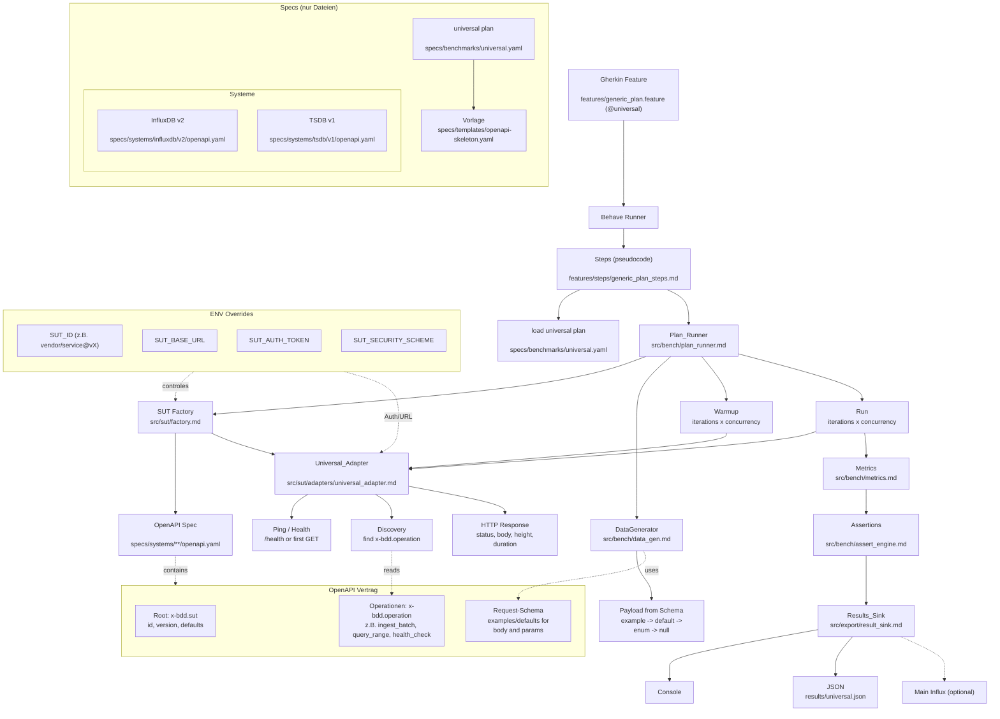

## 🚀 Adding & Activating a Service

Follow these steps to integrate a new service while keeping the project structure clean.

### 1. Register the Service

Add the service path and the specific `operationId` mappings to your root `mapping.yaml`.

```yaml
# mapping.yaml
my-new-service:
  spec_path: "vendor/my-service/openapi.yaml"
  operations:
    write: 
      operationId: "IngestMetrics"

```

### 2. Generate the Step File

Run the `generate.py` script. Based on our latest version, this will extract only the relevant portion of the OpenAPI spec and save the Python code to a dedicated service folder.

```bash
python generate.py write my-new-service

```

* **Output Location:** `services/my-new-service/write.py`

### 3. Activate the Service (The `ln` Step)

Because **Behave** strictly looks for a folder named `steps` inside your `features` directory, you must point that folder to your new service's code.

```bash
# Link features/steps to your specific service library
ln -sfn ../services/my-new-service features/steps

```

> **Tip:** The `../services/...` path is relative to the `features/` directory where the link sits.

### 4. Run the Benchmark

Now that the link is active, Behave will "see" the Python steps for your new service as if they were natively in the `features/steps` folder.

```bash
export ENV_NAME=<ENV-NAME>  && nix develop
behave --tags=@ingestion

```

---

## 📂 Project Structure Overview

After following this workflow, your directory tree looks like this:

```text
.
├── mapping.yaml
├── generate.py
├── features/
│   ├── write.feature
│   └── steps              # 🔗 SYMLINK -> ../services/my-new-service
├── services/
│   ├── influx-openapi/
│   │   └── write.py       # (Inactive)
│   └── my-new-service/
│       └── write.py       # (Active via link)
└── vendor/
    └── my-service/
        └── openapi.yaml

```

---
## Implemented services 

### InfluxDB

- **What does it do?**
  - Time-series database (TSDB) for storing and querying metrics/events via a well-defined HTTP API.

- **Why did we choose it?**
  - Baseline TSDB in our benchmark suite (clear ingest/query/delete semantics).
  - Comes with an upstream OpenAPI contract repo vendored as a submodule (`vendor/influx-openapi/...`), which fits our `generate.py + Gemini` workflow.

- **Potential problems**

### Prometheus (Server)

- **What does it do?**
  - Metrics/monitoring TSDB with PromQL query API; can accept data via Remote Write (if enabled).

- **Why did we choose it?**
  - Widely used OSS standard → expands our TSDB service range.
  - Strong “read/query” benchmarking via `query_range` (concurrency, p95/p99, etc.).

- **Potential problems**
  - No upstream, versioned OpenAPI contract like InfluxDB → we maintain a small “benchmark subset” OpenAPI spec to keep the Gemini generation flow working.
  - Write endpoint is **Remote Write (protobuf + snappy)**, not plain text; invalid payloads can produce `400` and skew availability/latency.


### Alertmanager

- **What does it do?**
  - Alert processing service (dedup/group/routing) with an HTTP API for alerts and silences.

- **Why did we choose it?**
  - Has an upstream OpenAPI/Swagger spec in the official repo → we can vendor it as a submodule (same pattern as Influx).
  - Adds another well-defined API SUT to validate our benchmark pipeline (availability/latency/concurrency).

- **Potential problems**
  - Not a TSDB: “query” is alert-state reads, not time-series queries → not directly comparable to TSDB query benchmarks.
  - “Delete” is management/control-plane (e.g., silences), not time-series data deletion.
  - Realism depends on having enough generated alerts/silences; otherwise endpoints may return near-empty results.


---

## 🛠 Switching Services

To switch from `my-new-service` back to `influx-openapi`, you only need to run the `ln` command again:

```bash
# Switch back to InfluxDB
ln -sfn ../services/influx-openapi features/steps

# Verify the link
ls -l features/steps

```

Would you like me to provide a **shell alias** or a tiny **`activate.sh`** script that you can use to switch between services even faster (e.g., `./activate.sh influx-openapi`)?

## Universal Benchmark Flow




